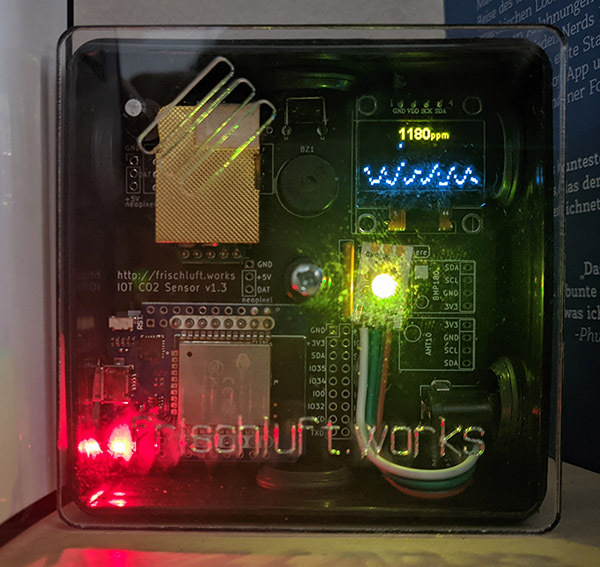
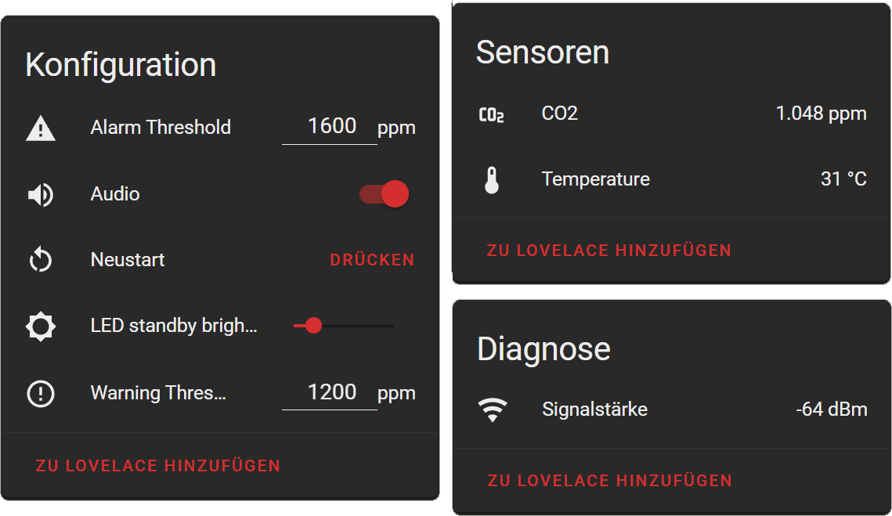
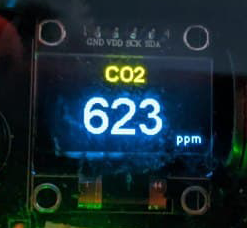

# Frischluft @ Home

A alternative firmware for the [frischluft.works project](https://github.com/frischluft-works).

Its based on ESPHome and this repository contains the configs to compile and upload a firmware to the frischluft.works board V1.3.

## Features

It has all the features of the official firmware like:

* Show the ppm value on the screen
* Set alarm thresholds
* Let the LED display red, orange, green according to the CO2 value
* Beep when a threshold is reached
* Calibration of the MH-Z19 CO2 sensor
* Publishing the values via MQTT
* Captive Portal when the WiFi is not reachable

New features with this firmware:

* Below the CO2 value on the screen the history of the last hours is shown
* The LED will now light up when a threshold was reached. After 20 seconds it will dimm to a configurable brightness value (default: 50%)
* Night mode will disable all LEDs and mute the beeper if enabled
* Set the alert thresholds / audio setting / thresholds via MQTT
* Home Assistant MQTT Autodiscovery
* The MH-Z19 can also measure temperature, so this is included on MQTT (seems way off)
* With ESPHome a way to wirelessly upgrade the firmware

Although there are some changes in functionallity comparing to the original firmware:

* The MQTT values contains now all config switches and values, those are optimized for a integration in [Home Assistant](https://www.home-assistant.io/)
* A single click on the button will show a status screen for network and mqtt connection.
* For calibration press the button for 3 to 5 seconds and release it. It will also take 20 min on a open window.
* No more Web-UI available (settings need to be set before compiling or via MQTT)

## Images





The bottom one shows the Home Assistant UI, which accesses and sets the MQTT values.

## Compile

To compile the `frischluft.works.yaml` ESPHome needs to be installed on your system.
Feel free to choose between the native install or docker.
Please follow the installation steps on the [ESPHome pages](https://esphome.io/guides/getting_started_command_line.html).

If have a running [Home Assistant](https://www.home-assistant.io/), you can also use the [ESPHome Addon](https://esphome.io/guides/getting_started_hassio.html) with it.

After installing ESPHome make sure you replace the values in the top `substitutions` section in `frischluft.works.yaml` with valid values for your environment.
If you don't use the MQTT connection, remove the `mqtt` section in line 28.
The defaults settings can be also adjusted in the `globals` section after line 34 (in case no MQTT is used).

In case you want to run the CO2 board standalone without WiFi, remove the `mqtt`, `wifi`, `captive_protal` and `ota` sections.

### Alternative Display-Mode



Instead of the small CO2 values on the top, the value will be displayed as big number in the lower part.

To enable it see the comment in the `frischluft.works.yaml` in the display section.

### CLI

If you using the terminal variants, the following command should let you compile the config in the repository root folder.

```shell
esphome run frischluft.works.yaml
# Or on docker
docker run --rm -v "${PWD}":/config --device=/dev/ttyUSB0 -it esphome/esphome run frischluft.works.yaml
```

### Home Assistant Addon

On the Home Assistant Addon, copy the folder `icon` and `fonts` as well as the `frischluft.works.yaml` file to your esphome folder.
Now you should be able to compile and upload it over the Addons Web-UI.

## Have fun

Have fun using this ESPHome config and you might find some thing to adjust which works better in your environment.
Maybe you want to have a rudimentary [web ui or a REST interface](https://esphome.io/components/web_server.html)?
Or if you don't want to use MQTT for the values and config, try the [native API of ESPHome](https://esphome.io/components/api.html).
